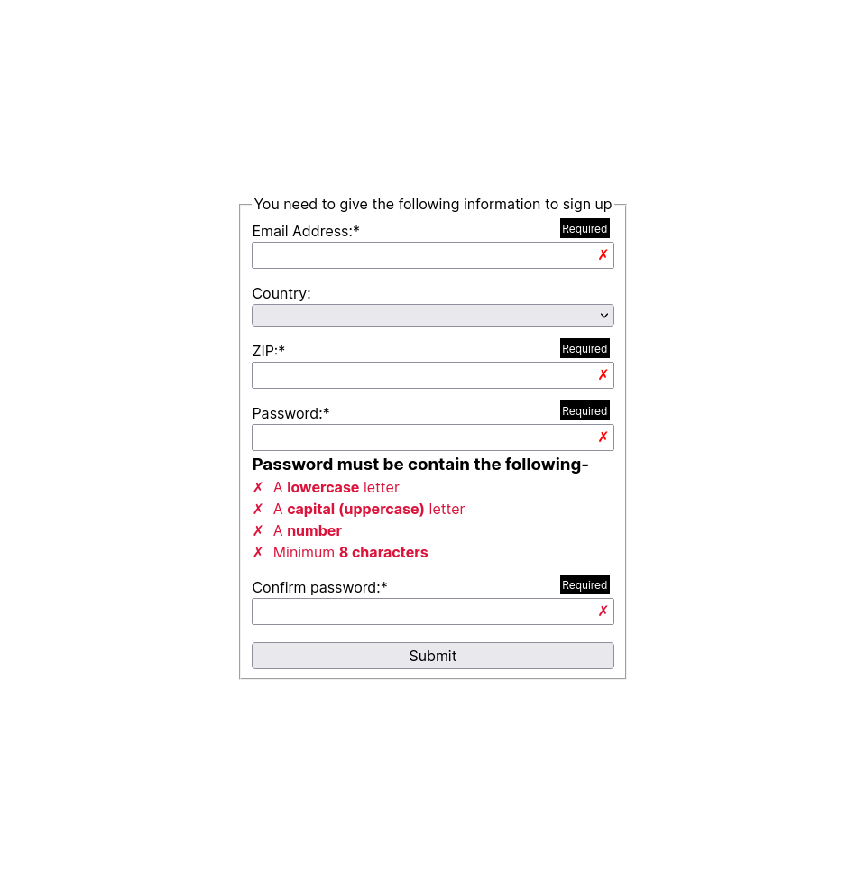

# Form Validation

This is a solution to the [The Odin Project form validation with javascript](https://www.theodinproject.com/lessons/node-path-javascript-form-validation-with-javascript). The Odin project
will help you to learn web development at your own pace.

## Table of contents

- [Overview](#overview)
  - [Screenshot](#screenshot)
  - [Links](#links)
- [My process](#my-process)
  - [Built with](#built-with)
- [Author](#author)

## Overview

### Screenshot

### Links

- Solution URL: [Solution](https://github.com/ZTanvir/odin-form-validation)
- Live Site URL: [Live site](https://ztanvir.github.io/odin-form-validation/)

## Bugs

- I haven't found yet.If anyone find any just let me know.

### For personal use

- Clone the code.
- Change the directory to odin-form-validation
- Open index.html with your browser

### Built with

- Semantic HTML5 markup
- CSS custom properties
- Flexbox
- Javscript
- Js Dom
- Web Api Constraint Validation

## Author

- Github - [Zahirul Islam Tanvir](https://github.com/ZTanvir)
